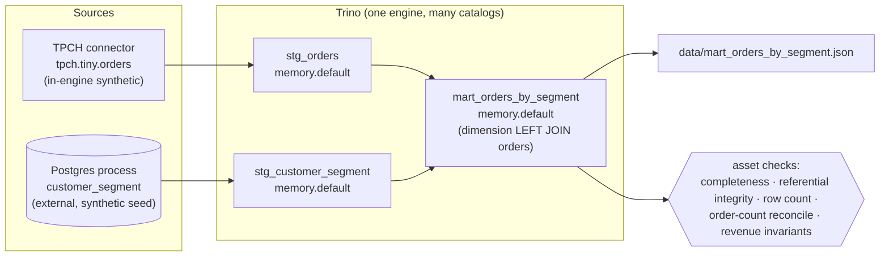

# data-platform-demo

A compact, self-contained data-engineering demo: **Dagster** orchestrating a
**Trino** federated SQL pipeline over synthetic and built-in public data. No
private data of any kind; everything is either Trino's built-in TPCH generator
or a small synthetic dimension table seeded into Postgres.

> **Local demo only.** Uses default credentials (`demo`/`demo`) and an
> unauthenticated Trino; not hardened and not for production use.

## What this demonstrates

- **Dagster software-defined assets with lineage** — a raw to staging to marts
  graph, each asset a typed materialization with metadata.
- **A schedule** — a daily `ScheduleDefinition` over a job that materializes all
  assets.
- **Asset checks as data-quality gates** — completeness (every expected
  segment x region cell present), referential integrity (no orphan cells),
  row-count, order-count reconciliation (`sum(order_count)` equals the staged
  orders count), and per-cell revenue invariants (`@asset_check`) attached to
  the mart. Each gate can actually fail on a real failure mode; see
  `tests/test_checks.py`, which proves each one fails on bad input and passes
  on good input.
- **Trino federated SQL** — one query engine (Trino) reading from a built-in
  TPCH connector and an external Postgres process, joining them in place. The
  Postgres leg is the genuinely cross-process read; TPCH is generated inside
  the same Trino server.
- **A staging to marts dimensional model** — fact (orders) joined to a dimension
  (customer segment/region), aggregated into a mart.
- **Reproducible infra** — `docker-compose` brings up Trino + Postgres with
  catalogs wired up; tear down with one command.
- **Pure, testable core** — SQL builders and validation logic are pure functions
  with unit tests that run with **no live Trino or Docker**.

## Architecture



Dagster materializes the three assets (`stg_orders`, `stg_customer_segment`,
`mart_orders_by_segment`); each runs SQL through the `TrinoResource`. The mart
joins the two staged tables in a single Trino query: `stg_orders` is generated
by Trino's built-in TPCH connector and `stg_customer_segment` is read from an
external Postgres process. That Postgres read is the genuinely cross-process
(federated) leg; the federation is one engine reading sources of different
kinds without an ETL copy into a shared warehouse. The join is a **LEFT JOIN
from the segment dimension to orders**, so every seeded segment x region cell
appears in the mart (with `order_count` 0 where a cell has no orders) rather
than being silently dropped. The mart also writes its rows to
`data/mart_orders_by_segment.json`, and the asset checks gate it.

### The federated query (one engine, two sources)

Trino exposes each backend as a *catalog*. `postgresql.properties` points at the
Postgres container; `tpch.properties` is Trino's built-in synthetic data
generator; `memory.properties` is an in-process scratch catalog used for the
staged + mart tables. Because all three live in the same Trino server, a single
SQL `JOIN` spans data that physically resides in two different systems. That is
the federation: no ETL copy step into a shared warehouse, just one engine
querying many sources.

### Asset checks as data-quality gates

`@asset_check`s run after the mart materializes and assert invariants that can
actually fail:

- **completeness** — the mart contains every expected segment x region cell.
  The expected universe is read live from the staged dimension; if the mart is
  missing a cell (the failure mode an INNER join would silently introduce),
  this check fails. `tests/test_checks.py::test_completeness_FAILS_on_old_inner_join_mart`
  pins the exact regression: the old mart dropped 3 of 12 cells.
- **referential integrity** — every mart cell exists in the dimension (no
  orphan / fabricated cells).
- **row count** — the mart has exactly the expected number of cells (catches
  partial builds and join fan-out).
- **order-count reconciliation** — `sum(mart.order_count)` equals the staged
  orders row count; a dropped or duplicated join leg breaks this identity.
- **revenue invariants** — per cell, revenue and counts are non-negative, and a
  zero-order cell carries exactly zero revenue.

Each returns an `AssetCheckResult` with metadata. The pass/fail logic lives in
pure functions in `data_platform/transforms.py`, so it is unit-tested directly
(`tests/test_checks.py`) without needing Trino running; each function has a test
that proves it fails on bad input and passes on good input.

The checks query **Trino** (the source of truth) for the mart rows and the
dimension. There is no silent fallback to the on-disk JSON: if Trino is
unreachable the check **fails** rather than passing on stale data. An explicit,
opt-in offline mode (`DPD_OFFLINE_MART_JSON=1`) reads the emitted JSON instead,
for demos/tests with no running engine; it is never the default.

Money is carried as `Decimal` end to end (Trino returns `Decimal` for
`SUM`/`AVG`); the JSON artifact emits revenue as a fixed-2 string to stay exact.

## Layout

```
docker-compose.yml          Trino + Postgres (arm64-compatible images)
postgres/init.sql           synthetic customer_segment dimension (custkey 1..50)
trino/etc/catalog/*.properties   postgresql, tpch, memory catalogs
data_platform/
  resources.py              TrinoResource (ConfigurableResource over trino DBAPI)
  sql.py                    pure SQL builders (unit-tested)
  transforms.py             pure transform + check logic (unit-tested)
  assets.py                 stg_orders, stg_customer_segment, mart_orders_by_segment
  checks.py                 @asset_check data-quality gates
  schedule.py               daily ScheduleDefinition + job
  definitions.py            Definitions(assets, asset_checks, jobs, schedules, resources)
scripts/run_pipeline.py     one-shot materialization against live Trino (no UI)
tests/                      pytest, runs with no Docker/Trino
```

## Run it

Prerequisites: Docker Desktop running, Python 3.10+.

### 1. Bring up infra

```bash
docker compose up -d
```

Postgres is published on host port **5433** (to avoid clashing with a local
Postgres); Trino on **8080**. Wait until Trino reports ready:

```bash
curl -s http://localhost:8080/v1/info   # "starting":false when ready
```

### 2. Create a venv and install

```bash
python3 -m venv .venv
source .venv/bin/activate
pip install -e ".[dev]"     # includes pytest; or: pip install -r requirements.txt
```

(`pip install -e .` alone installs the runtime only; the `dev` extra adds
`pytest`, which step 4 needs.)

### 3. Run the pipeline

Option A, via Dagster UI:

```bash
dagster dev                 # then open http://localhost:3000
# Materialize all assets from the Assets page; checks run with the mart.
```

Option B, one-shot script (no UI):

```bash
python scripts/run_pipeline.py
# Stages both sources, runs the federated join, writes the mart JSON,
# and prints the rows + check results.
```

### 4. Tests (no Docker needed)

```bash
python -m pytest -q
```

### 5. Tear down

```bash
docker compose down -v
```

## Notes

- Images are `postgres:16` and `trinodb/trino:latest`; both publish arm64, so
  this runs natively on Apple Silicon.
- The `memory` catalog is in-process; staged + mart tables disappear when the
  Trino container is removed. Re-running the pipeline recreates them.
- The mart has **12 rows** (3 segments x 4 regions), two of which carry
  `order_count` 0 in the TPCH `tiny` dataset; that is correct, not a gap, and is
  what the completeness check verifies.
- `make validate` runs `dagster definitions validate`, which prints a
  supersession notice; the current Dagster CLI prefers `dg check defs`. Either
  validates this project's `Definitions`.
- `TrinoResource` retries the connect with backoff, and `docker-compose.yml`
  gives Trino a healthcheck, so running the pipeline right after `up -d` waits
  for the engine instead of throwing a raw socket error.
- All data is synthetic or Trino-generated. There is nothing proprietary here.
```

A `Makefile` provides `make up`, `make down`, `make test`, `make run`, and
`make validate` as shortcuts.
